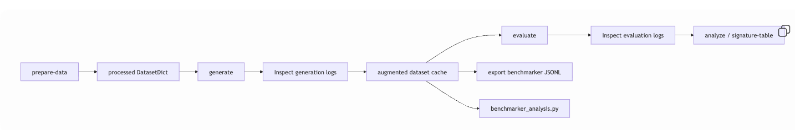

# Augmented MCQA

## Setup

```bash
cp .env.example .env
uv sync
```

If you will run local `vllm/...` models:

```bash
uv pip install --no-build-isolation 'vllm==0.11.2' 'transformers<5' 'numpy<2.3'
```

Set the provider keys you actually need in `.env`:

- `OPENAI_API_KEY` for GPT-5.2
- `ANTHROPIC_API_KEY` for Claude Opus
- `GOOGLE_API_KEY` for Gemini
- `TOGETHER_API_KEY` for Together-hosted Qwen 3.5 models

## The Normal Pipeline

This is the path the repo is now optimized for:

1. prepare `datasets/processed/unified_processed_v3`
2. generate distractors with either direct runs or the dependency-aware scheduler
3. evaluate those generated distractors with either direct runs or the dependency-aware scheduler
4. analyze the evaluation logs
5. export benchmarker files if needed

The scheduler supports both:

- local `vllm/...` jobs that request GPUs
- hosted/API jobs that request no GPU and just fan out `sbatch` workers

## Step 1: Prepare Data

```bash
uv run python main.py prepare-data \
  --step all \
  --output-path datasets/processed/unified_processed_v3
```

## Step 2: Generate Distractors

Pick one of the direct-run commands below for a simple single-process run, or use `submit-generate-cluster` to slice generation by:

- model
- dataset
- generation strategy
- question chunk

The schedulable generation strategies are:

- `model_from_scratch`
- `augment_human`
- `augment_model`
- `augment_ablation`

`human_from_scratch` remains implicit and is not scheduled as its own job.

### Direct API generators

GPT-5.2:

```bash
uv run python main.py generate \
  --model gpt-5.2-2025-12-11 \
  --run-name gen_gpt52 \
  --processed-dataset datasets/processed/unified_processed_v3 \
  --materialize-cache
```

Claude Opus 4.6:

```bash
uv run python main.py generate \
  --model claude-opus-4-6 \
  --run-name gen_claude_opus46 \
  --processed-dataset datasets/processed/unified_processed_v3 \
  --materialize-cache
```

Gemini 3.1 Pro:

```bash
uv run python main.py generate \
  --model gemini-3.1-pro-preview \
  --run-name gen_gemini31pro \
  --processed-dataset datasets/processed/unified_processed_v3 \
  --materialize-cache
```

TogetherAI Qwen/Qwen3.5-397B-A17B:

```bash
uv run python main.py generate \
  --model Qwen/Qwen3.5-397B-A17B \
  --run-name gen_together_qwen397b \
  --processed-dataset datasets/processed/unified_processed_v3 \
  --materialize-cache
```

TogetherAI Qwen/Qwen3.5-9B:

```bash
uv run python main.py generate \
  --model Qwen/Qwen3.5-9B \
  --run-name gen_together_qwen9b \
  --processed-dataset datasets/processed/unified_processed_v3 \
  --materialize-cache
```

### Dependency-aware scheduler for generation

Local and API models can be mixed in the same scheduler submission. The scheduler will:

- create one submission slice per `model × dataset × strategy × question_chunk`
- submit exact `afterok` dependencies when a slice needs another slice first
- use `afterany` throttling when `--gpu-count` is set as a concurrency cap
- skip already-current slices unless `--force` is used
- mark downstream slices stale when an upstream slice is rerun
- always refresh `scheduler_state.json`
- optionally write `scheduler_status.html`

Example: local + API generation in one run, chunked by 200 questions, with a status dashboard:

```bash
uv run python main.py submit-generate-cluster \
  --run-name gen_scheduler_all \
  --models Qwen/Qwen3-4B-Instruct-2507,allenai/Olmo-3-7B-Instruct,gpt-5.2-2025-12-11 \
  --processed-dataset datasets/processed/unified_processed_v3 \
  --generation-strategies model_from_scratch,augment_human,augment_model,augment_ablation \
  --questions-per-job 200 \
  --gpu-count 4 \
  --render-status
```

Example: rerun only `augment_model` for GPQA after editing that prompt:

```bash
uv run python main.py submit-generate-cluster \
  --run-name gen_scheduler_all \
  --models gpt-5.2-2025-12-11 \
  --processed-dataset datasets/processed/unified_processed_v3 \
  --dataset-types gpqa \
  --generation-strategies augment_model \
  --questions-per-job 200 \
  --force \
  --render-status
```

If the required `model_from_scratch` slice for the same model, dataset, and question chunk is not already current, the scheduler will stop and tell you to rerun or include that prerequisite slice.

## Step 3: Evaluate

The default local evaluation models are:

- `Qwen/Qwen3-4B-Instruct-2507`
- `allenai/Olmo-3-7B-Instruct`
- `meta-llama/Llama-3.1-8B-Instruct`

The evaluation scheduler slices work by:

- model
- dataset
- Final5 setting
- mode (`full_question` or `choices_only`)
- question chunk

Each evaluation slice depends on the exact generation slice or slices needed for that same dataset chunk. If those generation prerequisites are missing or stale, the scheduler refuses to submit the evaluation slice.

Example:

```bash
uv run python main.py submit-evaluate-cluster \
  --run-name eval_scheduler_all \
  --generator-run-name gen_scheduler_all \
  --generator-model gpt-5.2-2025-12-11 \
  --processed-dataset datasets/processed/unified_processed_v3 \
  --models Qwen/Qwen3-4B-Instruct-2507,allenai/Olmo-3-7B-Instruct,meta-llama/Llama-3.1-8B-Instruct \
  --settings human_from_scratch,model_from_scratch,augment_human,augment_model,augment_ablation \
  --modes full_question,choices_only \
  --questions-per-job 200 \
  --gpu-count 3 \
  --render-status
```

If you want to rerun only one evaluation slice family after a generation change, narrow it down with `--dataset-types`, `--settings`, `--modes`, and `--models`, then use `--force`.

Scheduler notes:

- `--questions-per-job` creates contiguous question chunks within each `model × dataset × strategy` or `model × dataset × setting × mode` slice family.
- `--gpu-count` is now a per-resource-class concurrency cap for the master submit script, not an array width.
- `--write-only` bundles show up as `planned` until `submit_all.sh` is actually run.
- manifests and master submit scripts live under `jobs/generated/<stage>/<run>/submissions/<submission_id>/`
- scheduler state lives at `jobs/generated/<stage>/<run>/scheduler_state.json`
- optional dashboard lives at `jobs/generated/<stage>/<run>/scheduler_status.html`

## Step 4: Analyze

```bash
uv run python main.py analyze \
  --results-root results/inspect/evaluation \
  --output-dir results/final5_plots
```

## Step 5: Export Benchmarker Items

Example for the GPT-5.2 generation run:

```bash
uv run python main.py export \
  --generator-run-name gen_gpt52 \
  --generator-model gpt-5.2-2025-12-11 \
  --processed-dataset datasets/processed/unified_processed_v3
```

If you used a different generator, keep the same command shape and change `--generator-run-name` and `--generator-model` to match Step 2.

## Optional: Standalone Benchmarker Writing-Flaw Analysis

Example for the GPT-5.2 generation run:

```bash
uv run python analysis/benchmarker_analysis.py \
  --writing-flaw-jsonl datasets/benchmarker_results/atrey_writing_flaw_rows.jsonl.zip \
  --results-root results/inspect/evaluation \
  --cache-root datasets/augmented \
  --generator-run-name gen_gpt52 \
  --generator-model gpt-5.2-2025-12-11 \
  --output-dir analysis/figures/benchmarker
```

## Canonical Artifacts

- processed dataset: `datasets/processed/unified_processed_v3`
- generation logs: `results/inspect/generation/<run>/<model>/`
- evaluation logs: `results/inspect/evaluation/<run>/<generator_run>/<generator_model>/<eval_model>/`
- augmented cache: `datasets/augmented/<run>/<model>/`
- cluster bundles: `jobs/generated/<stage>/<run>/`
- cluster logs: `logs/slurm/<stage>/<run>/`

## More Detail

- [`docs/cli-reference.md`](/Users/ndesai-air/Documents/GitHub/augmented-mcqa/docs/cli-reference.md)
- [`docs/architecture.md`](/Users/ndesai-air/Documents/GitHub/augmented-mcqa/docs/architecture.md)
